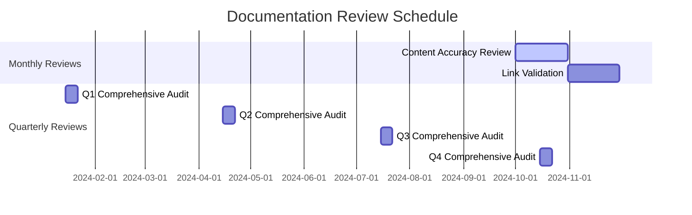

# Documentation Maintenance Guide

This guide outlines the procedures, schedules, and responsibilities for maintaining the Asset Marketing Studio project documentation to ensure it remains accurate, relevant, and valuable for all team members.

## 📋 Table of Contents

- [Maintenance Philosophy](#maintenance-philosophy)
- [Review Schedule](#review-schedule)
- [Maintenance Procedures](#maintenance-procedures)
- [Documentation Standards](#documentation-standards)
- [Team Responsibilities](#team-responsibilities)
- [Quality Assurance](#quality-assurance)
- [Tools and Automation](#tools-and-automation)
- [Metrics and KPIs](#metrics-and-kpis)
- [Emergency Procedures](#emergency-procedures)

---

## Maintenance Philosophy

### Documentation as a First-Class Citizen

Documentation is treated as a critical component of the project, not an afterthought. Well-maintained documentation:

- Reduces onboarding time for new team members
- Prevents knowledge loss when team members leave
- Improves code quality through better understanding
- Enhances collaboration across disciplines
- Serves as a single source of truth

### Continuous Maintenance Approach

We follow a continuous maintenance approach rather than periodic overhauls:

- **Small, regular updates** prevent documentation debt
- **Automated checks** catch common issues early
- **Peer reviews** ensure quality and accuracy
- **User feedback** drives improvements

---

## Review Schedule

### Regular Reviews

| Frequency | Scope | Responsible Party | Deliverable |
|-----------|-------|-------------------|-------------|
| **Weekly** | New feature documentation | Feature developers | Updated docs for new features |
| **Bi-weekly** | Link validation and formatting | Documentation lead | Link check report |
| **Monthly** | Content accuracy review | All team members | Review feedback |
| **Quarterly** | Comprehensive documentation audit | Documentation team | Audit report and action items |
| **Annually** | Documentation strategy review | Project leadership | Strategy updates |

### Trigger-Based Reviews

Documentation is reviewed when:

- **New features** are implemented
- **Breaking changes** are introduced
- **Security vulnerabilities** are discovered
- **User feedback** indicates issues
- **Performance metrics** show problems
- **Team structure** changes

### Review Calendar



---

## Maintenance Procedures

### 1. New Feature Documentation

**When**: During feature development, not after

**Procedure**:
1. **Planning Phase**
   - Create documentation outline with feature spec
   - Identify affected documentation files
   - Assign documentation owner

2. **Development Phase**
   - Draft documentation alongside code
   - Include code examples and use cases
   - Add cross-references to related docs

3. **Review Phase**
   - Technical review for accuracy
   - Editorial review for clarity
   - Accessibility review for compliance

4. **Publication Phase**
   - Update documentation index
   - Add to changelog
   - Announce updates to team

**Checklist**:
- [ ] Feature purpose and benefits explained
- [ ] Implementation details documented
- [ ] Code examples provided
- [ ] Cross-references added
- [ ] Updated in documentation index
- [ ] Accessibility compliance verified

### 2. Documentation Updates

**When**: Code changes affect existing documentation

**Procedure**:
1. **Identify Impact**
   - Search for references to changed code
   - Check for outdated examples
   - Verify configuration changes

2. **Update Content**
   - Revise affected sections
   - Update code examples
   - Modify diagrams if needed

3. **Verify Links**
   - Check internal links
   - Validate external references
   - Update table of contents

4. **Review and Publish**
   - Peer review for accuracy
   - Update version history
   - Communicate changes

**Checklist**:
- [ ] All references to changed code updated
- [ ] Code examples tested and working
- [ ] Links verified and working
- [ ] Version history updated
- [ ] Changes communicated to team

### 3. Link Validation

**When**: Bi-weekly automated check

**Procedure**:
1. **Automated Check**
   - Run link validation tool
   - Generate broken link report
   - Categorize issues by severity

2. **Manual Review**
   - Verify false positives
   - Check external links manually
   - Document temporary issues

3. **Fix Issues**
   - Update broken internal links
   - Replace or remove broken external links
   - Add redirects where appropriate

4. **Report Results**
   - Document fixes applied
   - Track recurring issues
   - Update maintenance procedures

**Tools**:
- `markdown-link-check` for automated validation
- Custom scripts for external link checking
- GitHub Actions for scheduled checks

### 4. Content Accuracy Review

**When**: Monthly team review

**Procedure**:
1. **Assign Sections**
   - Divide documentation among team members
   - Focus on areas of expertise
   - Rotate assignments monthly

2. **Review Criteria**
   - Technical accuracy
   - Current best practices
   - Clarity and completeness
   - Relevance to current project state

3. **Collect Feedback**
   - Use standardized feedback form
   - Track suggestions and issues
   - Prioritize by impact

4. **Implement Changes**
   - Update based on feedback
   - Discuss major changes with team
   - Document rationale for changes

---

## Documentation Standards

### Quality Standards

All documentation must meet these quality standards:

1. **Accuracy**
   - Technical information is correct
   - Code examples are tested
   - Configuration details are current

2. **Clarity**
   - Language is clear and concise
   - Concepts are explained simply
   - Structure is logical and intuitive

3. **Completeness**
   - All necessary information is included
   - Prerequisites are specified
   - Edge cases are addressed

4. **Accessibility**
   - Semantic heading structure
   - Alt text for images
   - Sufficient color contrast
   - Screen reader compatibility

5. **Maintainability**
   - Consistent formatting
   - Clear cross-references
   - Modular organization
   - Version control

### Formatting Standards

#### Markdown Structure
```markdown
# Document Title

Brief description of the document's purpose.

## Table of Contents (for documents > 5 sections)

## Section 1
Content with proper heading hierarchy.

### Subsection 1.1
Detailed content.

## Section 2
More content.

## See Also
- [Related Document](path/to/document.md)
- [Another Related Document](path/to/another.md)
```

#### Code Blocks
```typescript
// Always specify language
import { Component } from 'react';

// Include comments for complex code
const ExampleComponent = () => {
  return <div>Example</div>;
};
```

#### Links
```markdown
# Internal links (relative paths)
[Component Library](./COMPONENT_LIBRARY.md)

# External links (include title)
[Next.js Documentation](https://nextjs.org/docs "Next.js official docs")
```

### Version Control

#### File Naming
- Use kebab-case for file names: `documentation-guide.md`
- Include version for major updates: `api-v2.md`
- Use descriptive names: `component-library.md`

#### Commit Messages
```
docs: update component library documentation

- Add new Button component examples
- Fix broken links in API section
- Update TypeScript interfaces
```

#### Branch Strategy
- `main`: Stable documentation
- `develop`: Work in progress
- `docs/feature-name`: Feature documentation
- `docs/fix-name`: Documentation fixes

---

## Team Responsibilities

### Documentation Lead

**Primary Responsibilities**:
- Oversee documentation strategy and standards
- Coordinate review schedules and assignments
- Maintain documentation tools and automation
- Review and approve major documentation changes
- Monitor documentation metrics and KPIs

**Time Allocation**: 20% of weekly hours

### Developers

**Primary Responsibilities**:
- Document features during development
- Update documentation for code changes
- Provide technical review of documentation
- Create code examples and tutorials
- Participate in monthly accuracy reviews

**Time Allocation**: 10% of weekly hours

### Designers

**Primary Responsibilities**:
- Maintain design system documentation
- Create visual examples and diagrams
- Document UI patterns and guidelines
- Review documentation for visual consistency
- Contribute to design-related documentation

**Time Allocation**: 15% of weekly hours

### QA Team

**Primary Responsibilities**:
- Maintain testing documentation
- Document QA procedures and checklists
- Create testing guides and tutorials
- Review documentation for testability
- Verify documentation examples work as described

**Time Allocation**: 10% of weekly hours

### Technical Writers

**Primary Responsibilities**:
- Edit documentation for clarity and consistency
- Ensure documentation follows style guide
- Create tutorials and guides
- Manage documentation releases
- Gather and incorporate user feedback

**Time Allocation**: 100% of weekly hours (if dedicated role exists)

---

## Quality Assurance

### Automated Checks

#### GitHub Actions Workflow
```yaml
name: Documentation Quality Check

on:
  pull_request:
    paths:
      - 'docs/**'
      - '**.md'

jobs:
  quality-check:
    runs-on: ubuntu-latest
    steps:
      - uses: actions/checkout@v3
      
      - name: Check markdown formatting
        uses: articulate/actions-markdownlint@v1
        
      - name: Check for broken links
        uses: gaurav-nelson/github-action-markdown-link-check@v1
        
      - name: Check spelling
        uses: streetsidesoftware/cspell-action@v2
        
      - name: Generate metrics
        run: |
          # Custom script to generate documentation metrics
```

#### Pre-commit Hooks
```json
{
  "husky": {
    "hooks": {
      "pre-commit": "markdownlint '**/*.md' && markdown-link-check '**/*.md'"
    }
  }
}
```

### Manual Review Process

#### Documentation Review Checklist

**Content Quality**:
- [ ] Information is accurate and current
- [ ] Explanations are clear and concise
- [ ] Examples are practical and tested
- [ ] Structure is logical and easy to follow

**Technical Quality**:
- [ ] Code examples are syntax-highlighted
- [ ] Commands are tested and working
- [ ] Configuration details are complete
- [ ] Error handling is documented

**Accessibility**:
- [ ] Proper heading hierarchy (h1, h2, h3...)
- [ ] Alt text for all images
- [ ] Links have descriptive text
- [ ] Tables have captions and headers

**Cross-References**:
- [ ] Internal links are working
- [ ] External links are relevant and current
- [ ] "See Also" sections are comprehensive
- [ ] Related topics are linked appropriately

### Feedback Collection

#### User Feedback Form
```markdown
## Documentation Feedback

**Document**: [Document Name]
**Date**: [Date]

**Rate this document**:
- 😍 Very helpful
- 🙂 Helpful
- 😐 Neutral
- 🙁 Not helpful
- 😡 Confusing

**What were you looking for?**

**Did you find it?**

**How can we improve this documentation?**

**Additional comments**:
```

#### Feedback Integration Process

1. **Collect Feedback**
   - GitHub issues for documentation
   - Team feedback forms
   - User analytics and metrics
   - Direct team communication

2. **Analyze Feedback**
   - Categorize by type and priority
   - Identify patterns and trends
   - Assess impact and effort

3. **Plan Changes**
   - Create improvement backlog
   - Assign owners and timelines
   - Coordinate with feature development

4. **Implement Changes**
   - Update documentation based on feedback
   - Test changes for effectiveness
   - Communicate improvements

---

## Tools and Automation

### Documentation Tools

#### Core Tools
- **Markdown**: Standard documentation format
- **VS Code**: Primary editor with extensions
- **GitHub**: Version control and collaboration
- **GitHub Pages**: Documentation hosting

#### Specialized Tools
- **Mermaid**: Diagrams and visualizations
- **markdownlint**: Linting for markdown files
- **markdown-link-check**: Link validation
- **cspell**: Spell checking

### Automation Scripts

#### Link Checker Script
```bash
#!/bin/bash
# docs/scripts/check-links.sh

echo "Checking documentation links..."

# Check all markdown files
find . -name "*.md" -exec markdown-link-check {} \;

# Generate report
echo "Link check complete. Report saved to docs/reports/link-check-$(date +%Y%m%d).txt"
```

#### Documentation Metrics Script
```bash
#!/bin/bash
# docs/scripts/generate-metrics.sh

echo "Generating documentation metrics..."

# Count words in all documentation
total_words=$(find docs -name "*.md" -exec cat {} \; | wc -w)
echo "Total words: $total_words"

# Count number of documents
total_docs=$(find docs -name "*.md" | wc -l)
echo "Total documents: $total_docs"

# Generate report
echo "Metrics saved to docs/reports/metrics-$(date +%Y%m%d).json"
```

### GitHub Actions Templates

#### Documentation Update Action
```yaml
name: Update Documentation

on:
  push:
    paths:
      - 'docs/**'
      - '**.md'

jobs:
  update-docs:
    runs-on: ubuntu-latest
    steps:
      - uses: actions/checkout@v3
      
      - name: Setup Node.js
        uses: actions/setup-node@v3
        with:
          node-version: '18'
          
      - name: Install dependencies
        run: npm install
        
      - name: Run quality checks
        run: npm run docs:check
        
      - name: Generate documentation site
        run: npm run docs:build
        
      - name: Deploy to GitHub Pages
        uses: peaceiris/actions-gh-pages@v3
        with:
          github_token: ${{ secrets.GITHUB_TOKEN }}
          publish_dir: ./docs/dist
```

---

## Metrics and KPIs

### Documentation Health Metrics

#### Content Metrics
- **Coverage**: Percentage of features documented
- **Accuracy**: Number of reported inaccuracies
- **Completeness**: Percentage of required sections complete
- **Timeliness**: Average time from feature release to documentation

#### Usage Metrics
- **Page Views**: Most viewed documentation pages
- **Search Queries**: Most common search terms
- **Time on Page**: Engagement with documentation
- **Bounce Rate**: Percentage leaving without interaction

#### Quality Metrics
- **Broken Links**: Number of broken links
- **Spelling Errors**: Number of spelling mistakes
- **Formatting Issues**: Number of formatting problems
- **Accessibility Score**: WCAG compliance rating

#### Team Metrics
- **Contribution Rate**: Number of team members contributing
- **Review Participation**: Percentage participating in reviews
- **Update Frequency**: How often documentation is updated
- **Feedback Response**: Time to address feedback

### Tracking and Reporting

#### Monthly Report Template
```markdown
# Documentation Monthly Report - [Month] [Year]

## Summary
[Brief overview of documentation health this month]

## Key Metrics
- Coverage: [X]%
- Broken Links: [X]
- Pages Updated: [X]
- New Contributors: [X]

## Highlights
[Notable achievements and improvements]

## Challenges
[Issues encountered and how they were addressed]

## Next Month Focus
[Priority areas for next month]

## Detailed Metrics
[Detailed breakdown of all metrics]
```

#### Dashboard Configuration
```yaml
# docs/.github/workflows/metrics-dashboard.yml
name: Update Metrics Dashboard

on:
  schedule:
    - cron: '0 0 1 * *'  # First day of every month
  workflow_dispatch:

jobs:
  update-dashboard:
    runs-on: ubuntu-latest
    steps:
      - uses: actions/checkout@v3
      - name: Generate metrics
        run: |
          # Generate metrics data
          # Update dashboard files
      - name: Commit changes
        run: |
          git config --local user.email "action@github.com"
          git config --local user.name "GitHub Action"
          git add docs/metrics/
          git commit -m "Update metrics dashboard" || exit 0
          git push
```

---

## Emergency Procedures

### Critical Documentation Issues

#### Severity Levels

**Critical (Immediate Action Required)**
- Security vulnerabilities in documentation
- Complete documentation outage
- Critical misinformation leading to system damage

**High (24 Hours)**
- Widespread broken links
- Major feature releases without documentation
- Compliance violations

**Medium (1 Week)**
- Accumulated technical debt
- User-reported issues
- Accessibility violations

**Low (1 Month)**
- Minor inaccuracies
- Formatting issues
- Improvement opportunities

#### Emergency Response Process

1. **Identify Issue**
   - Monitor automated alerts
   - Review user reports
   - Assess impact and severity

2. **Immediate Response**
   - Implement temporary fixes
   - Communicate with affected users
   - Document the issue

3. **Resolution**
   - Implement permanent fix
   - Test thoroughly
   - Update related documentation

4. **Post-Mortem**
   - Analyze root cause
   - Document lessons learned
   - Update procedures to prevent recurrence

### Documentation Rollback

#### When to Rollback
- Documentation breaks the build
- Critical errors are discovered
- Security vulnerabilities are identified
- User feedback indicates major issues

#### Rollback Procedure
1. **Identify Last Known Good Version**
   ```bash
   git log --oneline docs/
   # Find the last commit with working documentation
   ```

2. **Create Backup**
   ```bash
   cp -r docs/ docs-backup-$(date +%Y%m%d)
   ```

3. **Rollback Changes**
   ```bash
   git checkout [commit-hash] -- docs/
   ```

4. **Verify Rollback**
   ```bash
   npm run docs:check
   npm run docs:build
   ```

5. **Communicate Rollback**
   - Notify team of rollback
   - Document reason and timeline
   - Plan fix and re-release

---

## Conclusion

Effective documentation maintenance is a team effort that requires commitment, processes, and tools. By following this guide, we ensure our documentation remains a valuable asset that supports our development process and helps our team work more efficiently.

Remember: **Documentation is not a one-time task but an ongoing process that evolves with our project.**

---

*This maintenance guide should be reviewed quarterly and updated as our documentation needs evolve.*