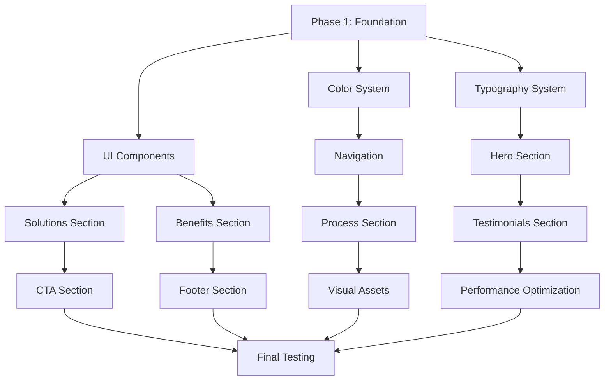

# The Asset Studio: Technical Implementation Roadmap

## Overview

This technical roadmap outlines the specific implementation steps, dependencies, and code changes required to transform The Asset Studio website according to the design strategy. The roadmap is organized by implementation order with clear dependencies and checkpoints.

## Implementation Order & Dependencies



## Phase 1: Foundation Updates (Days 1-3)

### 1.1 Color System Implementation

#### Dependencies: None
#### Files to Modify:
1. [`asset-marketing-studio/src/app/globals.css`](asset-marketing-studio/src/app/globals.css:1)
2. [`asset-marketing-studio/tailwind.config.ts`](asset-marketing-studio/tailwind.config.ts) (create if not exists)

#### Implementation Steps:

**Step 1.1.1: Update globals.css with new color system**
```css
:root {
  /* Primary Colors */
  --deep-blue: #0F172A;
  --electric-blue: #3B82F6;
  --accent-yellow: #FCD34D;
  --success-green: #10B981;
  
  /* Extended Palette */
  --dark-gray: #1F2937;
  --light-gray: #F9FAFB;
  --vibrant-purple: #8B5CF6;
  --warm-orange: #F97316;
  
  /* Gradient Definitions */
  --gradient-primary: linear-gradient(135deg, var(--electric-blue) 0%, var(--vibrant-purple) 100%);
  --gradient-accent: linear-gradient(135deg, var(--accent-yellow) 0%, var(--warm-orange) 100%);
  --gradient-text: linear-gradient(135deg, var(--electric-blue) 0%, var(--vibrant-purple) 100%);
  
  /* Glassmorphism */
  --glass-bg: rgba(255, 255, 255, 0.1);
  --glass-border: rgba(255, 255, 255, 0.2);
  --glass-shadow: 0 8px 32px 0 rgba(31, 38, 135, 0.37);
  
  /* Shadows */
  --shadow-soft: 0 4px 6px -1px rgba(0, 0, 0, 0.1), 0 2px 4px -1px rgba(0, 0, 0, 0.06);
  --shadow-medium: 0 10px 15px -3px rgba(0, 0, 0, 0.1), 0 4px 6px -2px rgba(0, 0, 0, 0.05);
  --shadow-large: 0 20px 25px -5px rgba(0, 0, 0, 0.1), 0 10px 10px -5px rgba(0, 0, 0, 0.04);
  
  /* Animation Timing */
  --animation-fast: 0.2s;
  --animation-normal: 0.3s;
  --animation-slow: 0.5s;
}
```

**Step 1.1.2: Create/Update tailwind.config.ts**
```typescript
import type { Config } from 'tailwindcss';

const config: Config = {
  content: [
    './src/pages/**/*.{js,ts,jsx,tsx,mdx}',
    './src/components/**/*.{js,ts,jsx,tsx,mdx}',
    './src/app/**/*.{js,ts,jsx,tsx,mdx}',
  ],
  theme: {
    extend: {
      colors: {
        'deep-blue': '#0F172A',
        'electric-blue': '#3B82F6',
        'accent-yellow': '#FCD34D',
        'success-green': '#10B981',
        'dark-gray': '#1F2937',
        'light-gray': '#F9FAFB',
        'vibrant-purple': '#8B5CF6',
        'warm-orange': '#F97316',
      },
      fontFamily: {
        'inter-display': ['var(--font-inter-display)'],
        'jetbrains-mono': ['var(--font-jetbrains-mono)'],
      },
      backgroundImage: {
        'gradient-primary': 'var(--gradient-primary)',
        'gradient-accent': 'var(--gradient-accent)',
        'gradient-text': 'var(--gradient-text)',
      },
      backdropBlur: {
        'xs': '2px',
      },
      animation: {
        'float': 'float 3s ease-in-out infinite',
        'pulse-slow': 'pulse-slow 4s ease-in-out infinite',
        'slide-up': 'slideUp 0.5s ease-out',
        'slide-in-left': 'slideInLeft 0.5s ease-out',
        'slide-in-right': 'slideInRight 0.5s ease-out',
      },
      keyframes: {
        float: {
          '0%, 100%': { transform: 'translateY(0px)' },
          '50%': { transform: 'translateY(-10px)' },
        },
        pulse-slow: {
          '0%, 100%': { opacity: '0.3' },
          '50%': { opacity: '0.5' },
        },
        slideUp: {
          '0%': { transform: 'translateY(20px)', opacity: '0' },
          '100%': { transform: 'translateY(0)', opacity: '1' },
        },
        slideInLeft: {
          '0%': { transform: 'translateX(-20px)', opacity: '0' },
          '100%': { transform: 'translateX(0)', opacity: '1' },
        },
        slideInRight: {
          '0%': { transform: 'translateX(20px)', opacity: '0' },
          '100%': { transform: 'translateX(0)', opacity: '1' },
        },
      },
    },
  },
  plugins: [],
};

export default config;
```

#### Verification Steps:
1. Run `npm run dev` to ensure no errors
2. Check browser dev tools for CSS variable availability
3. Verify Tailwind classes compile correctly

### 1.2 Typography System Implementation

#### Dependencies: Color System (1.1)
#### Files to Modify:
1. [`asset-marketing-studio/src/app/layout.tsx`](asset-marketing-studio/src/app/layout.tsx:5)
2. [`asset-marketing-studio/src/app/globals.css`](asset-marketing-studio/src/app/globals.css:1)

#### Implementation Steps:

**Step 1.2.1: Update layout.tsx with new fonts**
```typescript
import type { Metadata } from "next";
import { Inter, Inter_Display, JetBrains_Mono } from "next/font/google";
import "./globals.css";

const inter = Inter({
  subsets: ["latin"],
  variable: "--font-inter",
  display: "swap",
});

const interDisplay = Inter_Display({
  subsets: ["latin"],
  variable: "--font-inter-display",
  weight: ["700", "800", "900"],
  display: "swap",
});

const jetbrainsMono = JetBrains_Mono({
  subsets: ["latin"],
  variable: "--font-jetbrains-mono",
  display: "swap",
});

// ... rest of the metadata

export default function RootLayout({
  children,
}: Readonly<{
  children: React.ReactNode;
}>) {
  return (
    <html lang="en">
      <body
        className={`${inter.variable} ${interDisplay.variable} ${jetbrainsMono.variable} font-sans antialiased`}
      >
        {children}
      </body>
    </html>
  );
}
```

**Step 1.2.2: Add typography scale to globals.css**
```css
/* Typography Scale */
.text-hero {
  font-family: var(--font-inter-display);
  font-size: clamp(2.5rem, 5vw, 4.5rem);
  font-weight: 800;
  line-height: 1.1;
  letter-spacing: -0.025em;
}

.text-section {
  font-family: var(--font-inter-display);
  font-size: clamp(2rem, 4vw, 3rem);
  font-weight: 700;
  line-height: 1.2;
  letter-spacing: -0.025em;
}

.text-card-title {
  font-family: var(--font-inter);
  font-size: clamp(1.25rem, 2.5vw, 1.5rem);
  font-weight: 600;
  line-height: 1.3;
}

.text-body {
  font-family: var(--font-inter);
  font-size: clamp(0.875rem, 1.5vw, 1rem);
  font-weight: 400;
  line-height: 1.6;
}

.text-fine {
  font-family: var(--font-inter);
  font-size: clamp(0.75rem, 1.25vw, 0.875rem);
  font-weight: 400;
  line-height: 1.5;
}

.text-mono {
  font-family: var(--font-jetbrains-mono);
  font-size: clamp(0.875rem, 1.5vw, 1rem);
  font-weight: 400;
  line-height: 1.4;
}

/* Gradient Text */
.text-gradient {
  background: var(--gradient-text);
  -webkit-background-clip: text;
  -webkit-text-fill-color: transparent;
  background-clip: text;
}

/* Typography Animations */
@keyframes typewriter {
  from { width: 0; }
  to { width: 100%; }
}

@keyframes blink {
  50% { border-color: transparent; }
}

.typewriter {
  overflow: hidden;
  border-right: 3px solid var(--electric-blue);
  white-space: nowrap;
  animation: typewriter 3s steps(40, end), blink 0.75s step-end infinite;
}
```

#### Verification Steps:
1. Check font loading in browser dev tools
2. Verify typography scale at different viewport sizes
3. Test gradient text effects

### 1.3 Enhanced UI Components

#### Dependencies: Color System (1.1), Typography System (1.2)
#### Files to Modify:
1. [`asset-marketing-studio/src/components/ui/Button.tsx`](asset-marketing-studio/src/components/ui/Button.tsx:1)
2. [`asset-marketing-studio/src/components/ui/Card.tsx`](asset-marketing-studio/src/components/ui/Card.tsx:1)
3. [`asset-marketing-studio/src/components/ui/GlassCard.tsx`](asset-marketing-studio/src/components/ui/GlassCard.tsx:1) (create new)

#### Implementation Steps:

**Step 1.3.1: Enhanced Button Component**
```typescript
'use client';

import React from 'react';
import { ButtonProps } from '@/types';
import { motion } from 'framer-motion';
import { Loader2 } from 'lucide-react';

const Button: React.FC<ButtonProps> = ({
  children,
  variant = 'primary',
  size = 'md',
  href,
  onClick,
  className = '',
  loading = false,
  disabled = false,
}) => {
  const baseClasses = 'inline-flex items-center justify-center font-semibold rounded-lg transition-all duration-300 focus:outline-none focus:ring-2 focus:ring-offset-2 disabled:opacity-50 disabled:cursor-not-allowed';
  
  const variantClasses = {
    primary: 'bg-electric-blue text-white hover:bg-blue-700 focus:ring-electric-blue shadow-medium hover:shadow-large',
    secondary: 'bg-accent-yellow text-gray-900 hover:bg-yellow-500 focus:ring-accent-yellow shadow-medium hover:shadow-large',
    outline: 'border-2 border-electric-blue text-electric-blue hover:bg-electric-blue hover:text-white focus:ring-electric-blue',
    glass: 'bg-glass-bg border border-glass-border text-white hover:bg-white/20 focus:ring-white backdrop-blur-md',
    gradient: 'bg-gradient-primary text-white hover:opacity-90 focus:ring-electric-blue shadow-medium hover:shadow-large',
  };
  
  const sizeClasses = {
    sm: 'px-4 py-2 text-sm',
    md: 'px-6 py-3 text-base',
    lg: 'px-8 py-4 text-lg',
    xl: 'px-10 py-5 text-xl',
  };
  
  const classes = `${baseClasses} ${variantClasses[variant]} ${sizeClasses[size]} ${className}`;
  
  const MotionComponent = motion.button;
  const MotionLink = motion.a;
  
  const content = loading ? (
    <>
      <Loader2 className="mr-2 h-4 w-4 animate-spin" />
      {children}
    </>
  ) : (
    children
  );
  
  const animationProps = {
    whileHover: disabled ? {} : { scale: 1.05, y: -2 },
    whileTap: disabled ? {} : { scale: 0.98 },
    transition: { duration: 0.2 },
  };
  
  if (href) {
    return (
      <MotionLink
        href={href}
        className={classes}
        disabled={disabled}
        {...animationProps}
      >
        {content}
      </MotionLink>
    );
  }
  
  return (
    <MotionComponent
      className={classes}
      onClick={onClick}
      disabled={disabled || loading}
      {...animationProps}
    >
      {content}
    </MotionComponent>
  );
};

export default Button;
```

**Step 1.3.2: Enhanced Card Component**
```typescript
'use client';

import React from 'react';
import { CardProps } from '@/types';
import { motion } from 'framer-motion';

const Card: React.FC<CardProps> = ({ 
  children, 
  className = '',
  hover = true,
  glass = false,
}) => {
  const baseClasses = 'rounded-xl transition-all duration-300';
  
  const variantClasses = glass
    ? 'backdrop-blur-md bg-white/10 border border-white/20 shadow-glass'
    : 'bg-white shadow-medium hover:shadow-large';
  
  const hoverClasses = hover ? 'hover:-translate-y-1' : '';
  
  const classes = `${baseClasses} ${variantClasses} ${hoverClasses} ${className}`;
  
  return (
    <motion.div
      className={classes}
      whileHover={hover ? { y: -5, scale: 1.02 } : {}}
      transition={{ duration: 0.3 }}
    >
      {children}
    </motion.div>
  );
};

export default Card;
```

**Step 1.3.3: New GlassCard Component**
```typescript
'use client';

import React from 'react';
import { CardProps } from '@/types';
import { motion } from 'framer-motion';

const GlassCard: React.FC<CardProps> = ({ children, className = '' }) => {
  return (
    <motion.div
      className={`backdrop-blur-md bg-white/10 border border-white/20 rounded-xl ${className}`}
      style={{
        boxShadow: 'var(--glass-shadow)',
      }}
      whileHover={{ y: -5, scale: 1.02 }}
      transition={{ duration: 0.3 }}
    >
      {children}
    </motion.div>
  );
};

export default GlassCard;
```

**Step 1.3.4: Update Types**
Add to [`asset-marketing-studio/src/types/index.ts`](asset-marketing-studio/src/types/index.ts:1):
```typescript
export interface ButtonProps {
  children: React.ReactNode;
  variant?: 'primary' | 'secondary' | 'outline' | 'glass' | 'gradient';
  size?: 'sm' | 'md' | 'lg' | 'xl';
  href?: string;
  onClick?: () => void;
  className?: string;
  loading?: boolean;
  disabled?: boolean;
}

export interface CardProps {
  children: React.ReactNode;
  className?: string;
  hover?: boolean;
  glass?: boolean;
}
```

#### Verification Steps:
1. Test all button variants and sizes
2. Verify card hover effects and glassmorphism
3. Check responsive behavior
4. Test loading and disabled states

## Phase 2: Section Enhancements (Days 4-7)

### 2.1 Navigation Section Redesign

#### Dependencies: UI Components (1.3)
#### Files to Modify:
1. [`asset-marketing-studio/src/components/sections/Navigation.tsx`](asset-marketing-studio/src/components/sections/Navigation.tsx:1)

#### Implementation Steps:

**Step 2.1.1: Enhanced Navigation Component**
```typescript
'use client';

import React, { useState, useEffect } from 'react';
import { Menu, X, ChevronDown } from 'lucide-react';
import Button from '@/components/ui/Button';
import { motion, AnimatePresence } from 'framer-motion';

const Navigation: React.FC = () => {
  const [isOpen, setIsOpen] = useState(false);
  const [scrolled, setScrolled] = useState(false);
  const [hidden, setHidden] = useState(false);
  const [lastScrollY, setLastScrollY] = useState(0);

  useEffect(() => {
    const handleScroll = () => {
      const currentScrollY = window.scrollY;
      
      if (currentScrollY > 10) {
        setScrolled(true);
      } else {
        setScrolled(false);
      }
      
      if (currentScrollY > lastScrollY && currentScrollY > 100) {
        setHidden(true);
      } else {
        setHidden(false);
      }
      
      setLastScrollY(currentScrollY);
    };

    window.addEventListener('scroll', handleScroll);
    return () => window.removeEventListener('scroll', handleScroll);
  }, [lastScrollY]);

  const toggleMenu = () => {
    setIsOpen(!isOpen);
  };

  const navItems = [
    { name: 'Services', href: '#solutions', submenu: ['Campaigns', 'Analytics', 'Strategy'] },
    { name: 'Process', href: '#process' },
    { name: 'Results', href: '#testimonials' },
    { name: 'Pricing', href: '#pricing' },
    { name: 'FAQ', href: '#faq' },
  ];

  return (
    <motion.nav
      className={`fixed top-0 left-0 right-0 z-50 transition-all duration-300 ${
        scrolled 
          ? 'bg-glass-bg backdrop-blur-md border-b border-white/10 shadow-glass' 
          : 'bg-transparent'
      } ${hidden ? '-translate-y-full' : 'translate-y-0'}`}
      initial={{ y: -100 }}
      animate={{ y: hidden ? -100 : 0 }}
      transition={{ duration: 0.3 }}
    >
      <div className="relative z-10 max-w-7xl mx-auto px-4 sm:px-6 lg:px-8">
        <div className="flex justify-between items-center h-16">
          {/* Logo */}
          <motion.div 
            className="flex-shrink-0"
            whileHover={{ scale: 1.05 }}
            transition={{ duration: 0.2 }}
          >
            <a 
              href="#home" 
              aria-label="Go to home" 
              className={`text-2xl font-bold transition-colors duration-300 font-serif tracking-wide ${
                scrolled ? 'text-white' : 'text-white'
              }`}
              style={{ 
                textShadow: scrolled ? '1px 1px 2px rgba(0,0,0,0.8)' : '2px 2px 4px rgba(0,0,0,0.5)'
              }}
            >
              The Asset Studio
            </a>
          </motion.div>

          {/* Desktop Navigation */}
          <div className="hidden md:block">
            <div className="ml-10 flex items-baseline space-x-8">
              {navItems.map((item) => (
                <div key={item.name} className="relative group">
                  <a
                    href={item.href}
                    className={`px-3 py-2 text-sm font-medium transition-all duration-200 hover:text-accent-yellow ${
                      scrolled ? 'text-white' : 'text-white'
                    }`}
                  >
                    {item.name}
                    {item.submenu && (
                      <ChevronDown className="inline-block ml-1 h-4 w-4 group-hover:rotate-180 transition-transform duration-200" />
                    )}
                  </a>
                  
                  {/* Submenu */}
                  {item.submenu && (
                    <motion.div
                      className="absolute left-0 mt-2 w-48 rounded-lg shadow-large bg-glass-bg backdrop-blur-md border border-white/20 opacity-0 invisible group-hover:opacity-100 group-hover:visible transition-all duration-200"
                      initial={{ opacity: 0, y: -10 }}
                      animate={{ opacity: 1, y: 0 }}
                      exit={{ opacity: 0, y: -10 }}
                    >
                      {item.submenu.map((subItem) => (
                        <a
                          key={subItem}
                          href={`#${subItem.toLowerCase()}`}
                          className="block px-4 py-2 text-sm text-white hover:bg-white/10 hover:text-accent-yellow transition-colors duration-200"
                        >
                          {subItem}
                        </a>
                      ))}
                    </motion.div>
                  )}
                </div>
              ))}
            </div>
          </div>

          {/* Desktop CTA */}
          <motion.div 
            className="hidden md:block"
            whileHover={{ scale: 1.05 }}
            transition={{ duration: 0.2 }}
          >
            <Button
              href="#contact"
              size="sm"
              variant={scrolled ? "primary" : "glass"}
            >
              Book Call
            </Button>
          </motion.div>

          {/* Mobile menu button */}
          <div className="md:hidden">
            <button
              onClick={toggleMenu}
              className={`inline-flex items-center justify-center p-2 rounded-md transition-colors duration-200 focus:outline-none focus:ring-2 focus:ring-inset ${
                scrolled ? 'text-white hover:text-accent-yellow focus:ring-accent-yellow' : 'text-white hover:text-accent-yellow focus:ring-accent-yellow'
              }`}
            >
              <span className="sr-only">Open main menu</span>
              {isOpen ? <X className="h-6 w-6" /> : <Menu className="h-6 w-6" />}
            </button>
          </div>
        </div>
      </div>

      {/* Mobile menu */}
      <AnimatePresence>
        {isOpen && (
          <motion.div
            className="md:hidden bg-glass-bg backdrop-blur-md border-t border-white/20"
            initial={{ opacity: 0, height: 0 }}
            animate={{ opacity: 1, height: 'auto' }}
            exit={{ opacity: 0, height: 0 }}
            transition={{ duration: 0.3 }}
          >
            <div className="px-2 pt-2 pb-3 space-y-1 sm:px-3">
              {navItems.map((item) => (
                <div key={item.name}>
                  <a
                    href={item.href}
                    className="text-white hover:text-accent-yellow block px-3 py-2 text-base font-medium transition-colors duration-200"
                    onClick={() => setIsOpen(false)}
                  >
                    {item.name}
                  </a>
                  {item.submenu && (
                    <div className="pl-6 space-y-1">
                      {item.submenu.map((subItem) => (
                        <a
                          key={subItem}
                          href={`#${subItem.toLowerCase()}`}
                          className="text-gray-300 hover:text-accent-yellow block px-3 py-2 text-sm transition-colors duration-200"
                          onClick={() => setIsOpen(false)}
                        >
                          {subItem}
                        </a>
                      ))}
                    </div>
                  )}
                </div>
              ))}
              <div className="pt-4 pb-2">
                <Button href="#contact" size="sm" variant="secondary" className="w-full">
                  Book Call
                </Button>
              </div>
            </div>
          </motion.div>
        )}
      </AnimatePresence>
    </motion.nav>
  );
};

export default Navigation;
```

#### Verification Steps:
1. Test scroll behavior and transparency changes
2. Verify mobile menu functionality
3. Test submenu dropdowns
4. Check hide/show on scroll behavior

### 2.2 Hero Section Transformation

#### Dependencies: Navigation (2.1), Typography System (1.2)
#### Files to Modify:
1. [`asset-marketing-studio/src/components/sections/Hero.tsx`](asset-marketing-studio/src/components/sections/Hero.tsx:1)

#### Implementation Steps:

**Step 2.2.1: Enhanced Hero Component**
```typescript
'use client';

import React, { useEffect, useState } from 'react';
import { ArrowRight, Play, CheckCircle, TrendingUp, Users } from 'lucide-react';
import Button from '@/components/ui/Button';
import { motion, useScroll, useTransform } from 'framer-motion';

const Hero: React.FC = () => {
  const [scrollY, setScrollY] = useState(0);
  const { scrollYProgress } = useScroll();
  
  const opacity = useTransform(scrollYProgress, [0, 0.5], [1, 0]);
  const scale = useTransform(scrollYProgress, [0, 0.5], [1, 0.8]);
  
  useEffect(() => {
    const handleScroll = () => setScrollY(window.scrollY);
    window.addEventListener('scroll', handleScroll);
    return () => window.removeEventListener('scroll', handleScroll);
  }, []);

  const stats = [
    { icon: <TrendingUp className="h-5 w-5" />, value: "237%", label: "Average ROI" },
    { icon: <Users className="h-5 w-5" />, value: "500+", label: "Clients" },
    { icon: <CheckCircle className="h-5 w-5" />, value: "90 Days", label: "to Results" },
  ];

  return (
    <section id="home" className="relative min-h-screen flex items-center justify-center overflow-hidden">
      {/* Dynamic Background */}
      <div className="absolute inset-0 z-0">
        <div 
          className="absolute inset-0 bg-gradient-to-br from-deep-blue via-electric-blue/20 to-deep-blue"
          style={{
            transform: `translateY(${scrollY * 0.5}px)`,
          }}
        />
        <div 
          className="absolute inset-0 opacity-20"
          style={{
            backgroundImage: "url('/hero-bg.png')",
            backgroundSize: 'cover',
            backgroundPosition: 'center',
            backgroundRepeat: 'no-repeat',
            transform: `translateY(${scrollY * 0.3}px) scale(${1 + scrollY * 0.0005})`,
          }}
        />
        {/* Animated overlay pattern */}
        <div className="absolute inset-0 opacity-10">
          <div 
            className="absolute inset-0"
            style={{
              backgroundImage: `radial-gradient(circle at 20% 50%, rgba(252, 211, 77, 0.3) 0%, transparent 50%), 
                              radial-gradient(circle at 80% 80%, rgba(139, 92, 246, 0.3) 0%, transparent 50%)`,
              transform: `translateY(${scrollY * 0.2}px)`,
            }}
          />
        </div>
      </div>

      <motion.div 
        className="relative z-10 max-w-7xl mx-auto px-4 sm:px-6 lg:px-8 py-24"
        style={{ opacity, scale }}
      >
        <div className="text-center">
          {/* Animated Badge */}
          <motion.div
            className="inline-flex items-center px-4 py-2 mb-6 bg-glass-bg backdrop-blur-md border border-white/20 rounded-full"
            initial={{ opacity: 0, y: 20 }}
            animate={{ opacity: 1, y: 0 }}
            transition={{ duration: 0.6, delay: 0.2 }}
          >
            <CheckCircle className="h-4 w-4 text-accent-yellow mr-2" />
            <span className="text-white text-sm font-medium">
              90-Day Performance Guarantee
            </span>
          </motion.div>

          {/* Kinetic Typography Headline */}
          <motion.h1
            className="text-hero text-white mb-6"
            initial={{ opacity: 0, y: 30 }}
            animate={{ opacity: 1, y: 0 }}
            transition={{ duration: 0.8 }}
          >
            Double your sales in{' '}
            <motion.span 
              className="text-gradient inline-block"
              whileHover={{ scale: 1.05 }}
              transition={{ duration: 0.2 }}
            >
              90 days
            </motion.span>
            {' '}or it's free
          </motion.h1>

          {/* Subtitle */}
          <motion.p
            className="text-body text-gray-100 mb-8 max-w-3xl mx-auto"
            initial={{ opacity: 0, y: 30 }}
            animate={{ opacity: 1, y: 0 }}
            transition={{ duration: 0.8, delay: 0.2 }}
          >
            High-performing marketing campaigns for brands that demand measurable results
          </motion.p>

          {/* Animated Stats */}
          <motion.div
            className="grid grid-cols-3 gap-8 mb-10 max-w-2xl mx-auto"
            initial={{ opacity: 0, y: 30 }}
            animate={{ opacity: 1, y: 0 }}
            transition={{ duration: 0.8, delay: 0.3 }}
          >
            {stats.map((stat, index) => (
              <motion.div
                key={index}
                className="text-center"
                whileHover={{ scale: 1.1 }}
                transition={{ duration: 0.2 }}
              >
                <div className="flex justify-center mb-2 text-accent-yellow">
                  {stat.icon}
                </div>
                <div className="text-2xl font-bold text-white">
                  {stat.value}
                </div>
                <div className="text-sm text-gray-300">
                  {stat.label}
                </div>
              </motion.div>
            ))}
          </motion.div>

          {/* Video Testimonial */}
          <motion.div
            className="mb-10 max-w-4xl mx-auto"
            initial={{ opacity: 0, y: 30 }}
            animate={{ opacity: 1, y: 0 }}
            transition={{ duration: 0.8, delay: 0.4 }}
          >
            <div className="relative group">
              <div className="relative w-full h-0 pb-[56.25%] rounded-xl overflow-hidden shadow-large">
                <iframe
                  className="absolute top-0 left-0 w-full h-full"
                  src="https://www.youtube.com/embed/XeIx4S6YvGo"
                  title="YouTube video player"
                  frameBorder="0"
                  allow="accelerometer; autoplay; clipboard-write; encrypted-media; gyroscope; picture-in-picture"
                  allowFullScreen
                ></iframe>
              </div>
              {/* Play button overlay */}
              <div className="absolute inset-0 flex items-center justify-center opacity-0 group-hover:opacity-100 transition-opacity duration-300 pointer-events-none">
                <div className="bg-accent-yellow rounded-full p-4 shadow-large">
                  <Play className="h-8 w-8 text-gray-900" />
                </div>
              </div>
            </div>
          </motion.div>

          {/* CTA Buttons */}
          <motion.div
            className="flex flex-col sm:flex-row gap-4 justify-center"
            initial={{ opacity: 0, y: 30 }}
            animate={{ opacity: 1, y: 0 }}
            transition={{ duration: 0.8, delay: 0.5 }}
          >
            <Button 
              href="#contact" 
              size="lg" 
              variant="secondary" 
              className="group shadow-large hover:shadow-xl"
            >
              Book Your Free Call
              <ArrowRight className="ml-2 h-5 w-5 group-hover:translate-x-1 transition-transform duration-300" />
            </Button>
            <Button 
              variant="glass" 
              size="lg" 
              href="#solutions" 
              className="border-white text-white hover:bg-white hover:text-gray-900"
            >
              See How It Works
            </Button>
          </motion.div>
        </div>
      </motion.div>

      {/* Scroll Indicator */}
      <motion.div
        className="absolute bottom-8 left-1/2 transform -translate-x-1/2"
        initial={{ opacity: 0 }}
        animate={{ opacity: 1 }}
        transition={{ duration: 0.6, delay: 1 }}
      >
        <motion.div
          className="w-6 h-10 border-2 border-white/30 rounded-full flex justify-center"
          animate={{ y: [0, 10, 0] }}
          transition={{ duration: 2, repeat: Infinity }}
        >
          <div className="w-1 h-3 bg-white rounded-full mt-2"></div>
        </motion.div>
      </motion.div>
    </section>
  );
};

export default Hero;
```

#### Verification Steps:
1. Test parallax scrolling effects
2. Verify kinetic typography animations
3. Check stats counter animations
4. Test responsive behavior

### 2.3 Solutions Section Enhancement

#### Dependencies: UI Components (1.3)
#### Files to Modify:
1. [`asset-marketing-studio/src/components/sections/Solutions.tsx`](asset-marketing-studio/src/components/sections/Solutions.tsx:1)

#### Implementation Steps:

**Step 2.3.1: Enhanced Solutions Component**
```typescript
'use client';

import React, { useState } from 'react';
import { Target, Zap, BarChart3, Lightbulb, ArrowRight } from 'lucide-react';
import Card from '@/components/ui/Card';
import Button from '@/components/ui/Button';
import { motion } from 'framer-motion';

const Solutions: React.FC = () => {
  const [activeCategory, setActiveCategory] = useState('all');
  
  const categories = ['all', 'campaigns', 'analytics', 'strategy'];
  
  const solutions = [
    {
      id: 1,
      icon: <Target className="h-12 w-12 text-electric-blue" />,
      title: "Targeted Campaigns",
      description: "Precision marketing that reaches your ideal customers where they spend their time.",
      category: 'campaigns',
      details: "Advanced audience segmentation and behavioral targeting across multiple platforms.",
      metrics: { conversion: "45%", reach: "2.5M", roi: "320%" }
    },
    {
      id: 2,
      icon: <Zap className="h-12 w-12 text-electric-blue" />,
      title: "Rapid Implementation",
      description: "Get your campaigns up and running in days, not weeks, with our streamlined process.",
      category: 'campaigns',
      details: "Agile deployment methodology with real-time optimization.",
      metrics: { launch: "48hrs", optimization: "24/7", results: "7 days" }
    },
    {
      id: 3,
      icon: <BarChart3 className="h-12 w-12 text-electric-blue" />,
      title: "Performance Analytics",
      description: "Real-time insights and data-driven optimizations to maximize your ROI.",
      category: 'analytics',
      details: "Comprehensive dashboard with predictive analytics and A/B testing.",
      metrics: { insights: "200+", reports: "Daily", accuracy: "98%" }
    },
    {
      id: 4,
      icon: <Lightbulb className="h-12 w-12 text-electric-blue" />,
      title: "Creative Strategy",
      description: "Innovative approaches that cut through the noise and capture attention.",
      category: 'strategy',
      details: "Award-winning creative team with proven viral campaign success.",
      metrics: { awards: "12", virality: "3.2M", engagement: "67%" }
    }
  ];

  const filteredSolutions = activeCategory === 'all' 
    ? solutions 
    : solutions.filter(s => s.category === activeCategory);

  const containerVariants = {
    hidden: { opacity: 0 },
    visible: {
      opacity: 1,
      transition: {
        staggerChildren: 0.1
      }
    }
  };

  const itemVariants = {
    hidden: { opacity: 0, y: 30 },
    visible: { opacity: 1, y: 0 }
  };

  return (
    <section id="solutions" className="py-20 bg-light-gray">
      <div className="max-w-7xl mx-auto px-4 sm:px-6 lg:px-8">
        {/* Section Header */}
        <motion.div
          className="text-center mb-16"
          initial={{ opacity: 0, y: 20 }}
          whileInView={{ opacity: 1, y: 0 }}
          viewport={{ once: true }}
          transition={{ duration: 0.6 }}
        >
          <h2 className="text-section text-gray-900 mb-4">
            Solutions That <span className="text-gradient">Drive Results</span>
          </h2>
          <p className="text-body text-gray-600 max-w-3xl mx-auto">
            Our comprehensive suite of marketing services designed to accelerate your business growth
          </p>
        </motion.div>

        {/* Category Filter */}
        <motion.div
          className="flex flex-wrap justify-center gap-4 mb-12"
          initial={{ opacity: 0, y: 20 }}
          whileInView={{ opacity: 1, y: 0 }}
          viewport={{ once: true }}
          transition={{ duration: 0.6, delay: 0.1 }}
        >
          {categories.map((category) => (
            <Button
              key={category}
              variant={activeCategory === category ? "primary" : "outline"}
              size="sm"
              onClick={() => setActiveCategory(category)}
              className="capitalize"
            >
              {category}
            </Button>
          ))}
        </motion.div>

        {/* Solutions Grid */}
        <motion.div
          className="grid grid-cols-1 md:grid-cols-2 lg:grid-cols-4 gap-8"
          initial="hidden"
          whileInView="visible"
          viewport={{ once: true }}
          variants={containerVariants}
        >
          {filteredSolutions.map((solution, index) => (
            <motion.div
              key={solution.id}
              variants={itemVariants}
              transition={{ duration: 0.5 }}
              className="group"
            >
              <Card className="h-full p-8 text-center hover:shadow-2xl relative overflow-hidden">
                {/* Hover gradient overlay */}
                <div className="absolute inset-0 bg-gradient-to-br from-electric-blue/5 to-vibrant-purple/5 opacity-0 group-hover:opacity-100 transition-opacity duration-300" />
                
                <div className="relative z-10">
                  <div className="flex justify-center mb-6 group-hover:scale-110 transition-transform duration-300">
                    {solution.icon}
                  </div>
                  
                  <h3 className="text-card-title text-gray-900 mb-4">
                    {solution.title}
                  </h3>
                  
                  <p className="text-body text-gray-600 mb-6">
                    {solution.description}
                  </p>
                  
                  {/* Metrics */}
                  <div className="grid grid-cols-3 gap-2 mb-6">
                    {Object.entries(solution.metrics).map(([key, value]) => (
                      <div key={key} className="text-center">
                        <div className="text-lg font-bold text-electric-blue">
                          {value}
                        </div>
                        <div className="text-xs text-gray-500 capitalize">
                          {key}
                        </div>
                      </div>
                    ))}
                  </div>
                  
                  {/* Expandable Details */}
                  <motion.div
                    className="text-left"
                    initial={{ height: 0, opacity: 0 }}
                    whileHover={{ height: 'auto', opacity: 1 }}
                    transition={{ duration: 0.3 }}
                  >
                    <p className="text-sm text-gray-600 mb-4">
                      {solution.details}
                    </p>
                  </motion.div>
                  
                  <Button 
                    variant="outline" 
                    size="sm" 
                    className="w-full group-hover:bg-electric-blue group-hover:text-white transition-colors duration-300"
                  >
                    Learn More
                    <ArrowRight className="ml-2 h-4 w-4 group-hover:translate-x-1 transition-transform duration-300" />
                  </Button>
                </div>
              </Card>
            </motion.div>
          ))}
        </motion.div>

        {/* Guarantee Section */}
        <motion.div
          className="mt-16 text-center"
          initial={{ opacity: 0, y: 20 }}
          whileInView={{ opacity: 1, y: 0 }}
          viewport={{ once: true }}
          transition={{ duration: 0.6, delay: 0.3 }}
        >
          <div className="inline-flex items-center justify-center p-8 bg-gradient-to-r from-electric-blue to-vibrant-purple rounded-2xl shadow-large text-white relative overflow-hidden">
            {/* Animated background pattern */}
            <div className="absolute inset-0 opacity-10">
              <div className="absolute inset-0 bg-repeat" style={{
                backgroundImage: `url("data:image/svg+xml,%3Csvg width='40' height='40' viewBox='0 0 40 40' xmlns='http://www.w3.org/2000/svg'%3E%3Cg fill='%23ffffff' fill-opacity='0.4'%3E%3Cpath d='M0 40L40 0H20L0 20M40 40V20L20 40'/%3E%3C/g%3E%3C/svg%3E")`,
                backgroundSize: '40px 40px',
              }} />
            </div>
            
            <div className="relative z-10">
              <h4 className="text-2xl font-bold mb-2">
                90-Day Performance Guarantee
              </h4>
              <p className="text-lg opacity-90 mb-4">
                If you don't see results in 90 days, we work for free until you do.
              </p>
              <Button variant="secondary" size="md" className="bg-accent-yellow text-gray-900 hover:bg-yellow-500">
                Get Started Risk-Free
              </Button>
            </div>
          </div>
        </motion.div>
      </div>
    </section>
  );
};

export default Solutions;
```

#### Verification Steps:
1. Test category filtering functionality
2. Verify hover effects and animations
3. Check metrics display
4. Test responsive behavior

## Implementation Checklist

### Phase 1 Checklist
- [ ] Update color system in globals.css
- [ ] Configure Tailwind with new colors and fonts
- [ ] Add new fonts to layout.tsx
- [ ] Implement typography scale
- [ ] Enhance Button component with new variants
- [ ] Enhance Card component with glassmorphism
- [ ] Create GlassCard component
- [ ] Update TypeScript types

### Phase 2 Checklist
- [ ] Redesign Navigation with glassmorphism
- [ ] Transform Hero section with kinetic typography
- [ ] Enhance Solutions section with filtering
- [ ] Update Benefits section with new design
- [ ] Test all responsive breakpoints
- [ ] Verify animations and micro-interactions

## Rollback Procedures

### Phase 1 Rollback
1. Revert globals.css to previous version
2. Restore original tailwind.config.ts
3. Remove new font imports from layout.tsx
4. Restore original Button and Card components

### Phase 2 Rollback
1. Restore original Navigation component
2. Revert Hero section to previous version
3. Restore original Solutions component
4. Test all functionality after rollback

## Testing Procedures

### Visual Testing
1. Screenshot comparison for each section
2. Cross-browser testing (Chrome, Firefox, Safari, Edge)
3. Responsive testing at breakpoints: sm (640px), md (768px), lg (1024px), xl (1280px)
4. Color contrast testing for accessibility

### Functional Testing
1. Navigation menu functionality
2. Button interactions and states
3. Form submissions (if applicable)
4. Video player functionality
5. Mobile menu behavior

### Performance Testing
1. Page load speed with Web Vitals
2. Animation performance on lower-end devices
3. Image optimization verification
4. Bundle size analysis

This technical roadmap provides a detailed, step-by-step implementation plan that can be followed systematically to transform The Asset Studio website according to the design strategy while maintaining functionality and performance.