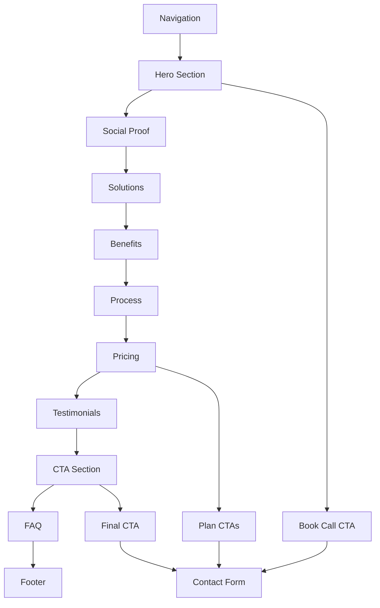

# ASSET Marketing Studio Landing Page Architecture

## Project Overview
This document outlines the technical architecture and implementation plan for the ASSET Marketing Studio landing page, designed to be a high-converting marketing tool.

## Technology Stack
- **Framework**: Next.js 14 with App Router
- **Language**: TypeScript for type safety
- **Styling**: Tailwind CSS for utility-first styling
- **Icons**: React Icons or Heroicons
- **Animations**: Framer Motion for smooth transitions
- **Forms**: React Hook Form for contact forms

## Project Structure
```
asset-marketing-studio/
├── app/
│   ├── layout.tsx          # Root layout with metadata
│   ├── page.tsx            # Main landing page
│   ├── globals.css         # Global styles and Tailwind imports
│   └── favicon.ico
├── components/
│   ├── ui/                 # Reusable UI components
│   │   ├── Button.tsx
│   │   ├── Card.tsx
│   │   └── Accordion.tsx
│   ├── sections/           # Landing page sections
│   │   ├── Hero.tsx
│   │   ├── Navigation.tsx
│   │   ├── SocialProof.tsx
│   │   ├── Solutions.tsx
│   │   ├── Benefits.tsx
│   │   ├── Process.tsx
│   │   ├── Pricing.tsx
│   │   ├── Testimonials.tsx
│   │   ├── CTA.tsx
│   │   ├── FAQ.tsx
│   │   └── Footer.tsx
│   └── layout/
│       └── Header.tsx
├── public/
│   ├── images/             # All images and assets
│   └── icons/              # Icon files
├── types/
│   └── index.ts            # TypeScript type definitions
├── utils/
│   └── helpers.ts          # Utility functions
├── tailwind.config.js      # Tailwind configuration
├── next.config.js          # Next.js configuration
├── tsconfig.json           # TypeScript configuration
└── package.json            # Dependencies and scripts
```

## Design System

### Color Palette
- **Primary**: Blue (#3B82F6) for CTAs and important elements
- **Secondary**: Yellow (#FCD34D) for accents and highlights
- **Success**: Green (#10B981) for success states and CTA section
- **Neutral**: Various shades of gray for text and backgrounds
- **White**: (#FFFFFF) for clean backgrounds

### Typography
- **Headings**: Inter or system fonts, bold weights
- **Body**: Inter or system fonts, regular weights
- **Hierarchy**: Clear size and weight variations

## Component Architecture

### Section Components
1. **Navigation**: Fixed header with logo, menu items, and CTA button
2. **Hero**: Full-width section with headline, subheading, and primary CTA
3. **SocialProof**: Client logos or testimonials with trust indicators
4. **Solutions**: Grid of 3-4 services with icons and descriptions
5. **Benefits**: Grid layout with colored cards (yellow accents)
6. **Process**: 3-step workflow with numbered progression
7. **Pricing**: Two-tier pricing comparison with feature lists
8. **Testimonials**: Customer reviews with ratings and names
9. **CTA**: Compelling call-to-action with contrasting background
10. **FAQ**: Accordion-style frequently asked questions
11. **Footer**: Logo, URL, and basic navigation

### Reusable UI Components
- **Button**: Multiple variants (primary, secondary, outline)
- **Card**: Flexible card component for different use cases
- **Accordion**: Expandable FAQ items
- **Icon**: Consistent icon wrapper

## Responsive Design Strategy
- **Mobile-first approach** using Tailwind's responsive utilities
- **Breakpoints**: sm (640px), md (768px), lg (1024px), xl (1280px)
- **Adaptive layouts** for different screen sizes
- **Touch-friendly** interactive elements on mobile

## Performance Considerations
- **Image optimization** using Next.js Image component
- **Code splitting** with Next.js automatic optimization
- **Lazy loading** for below-the-fold sections
- **Minimal dependencies** to reduce bundle size

## SEO Optimization
- **Semantic HTML5** structure for better accessibility
- **Meta tags** for search engines and social sharing
- **Open Graph** tags for social media previews
- **Structured data** for search engines
- **Alt text** for all images

## Content Strategy
- **Benefit-focused** copy addressing customer pain points
- **Power words** in headlines for emotional impact
- **Scannable content** with short paragraphs and bullet points
- **Social proof** elements to build trust
- **Clear CTAs** with action-oriented language

## Interactive Elements
- **Smooth scrolling** between sections
- **Hover states** on all interactive elements
- **Micro-interactions** for better user engagement
- **Form validation** for contact forms
- **Loading states** for better perceived performance

## Implementation Phases

### Phase 1: Foundation
- Set up Next.js 14 project with TypeScript and Tailwind CSS
- Create project folder structure and basic components
- Implement responsive navigation bar with logo and menu

### Phase 2: Core Sections
- Build hero section with headline, subheading, and primary CTA
- Create social proof section with client logos/testimonials
- Develop solutions section showcasing 3-4 key services
- Build benefits section with grid layout and colored cards

### Phase 3: Conversion Elements
- Implement process section showing 3-step workflow
- Create pricing section with Basic and Pro tiers
- Add testimonials section with customer reviews
- Build compelling CTA section with contrasting background

### Phase 4: Finalization
- Implement FAQ section with accordion-style layout
- Create footer with logo and navigation links
- Add animations, transitions, and hover states
- Implement responsive design for mobile devices
- Add SEO optimization and meta tags
- Test and finalize the landing page

## Mermaid Diagram: Page Flow



This architecture provides a solid foundation for building a high-converting landing page that meets all the specified requirements. The component-based approach ensures maintainability, while the design system guarantees consistency throughout the site.